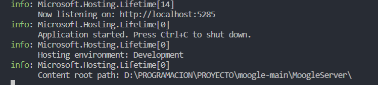

# Moogle!


> Proyecto de Programación I.\
> Facultad de Matemática y Computación - Universidad de La Habana.\
> Cursos 2022, 2023.\
> Arianne Camila Palancar Ochando C113

## Que es Moogle?
Es un buscador de documentos del formato *.txt, que dada una busqueda del usuario, devuelve los resultados mas relevantes de dicha busqueda en una base de datos (carpeta).

## Como ejecutar el Moogle?
Para poder ejecutar el proyecto:

1) Abrir la carpeta donde se encuentra el proyecto
2) Abrir Terminal / Consola y escribir el siguiente comando:
```
dotnet run --project MoogleServer
```

3) Abrir en el navegador la direccion que ofrece:



### **Una vez realizados estos pasos ya puede usar el Moogle y comenzar a hacer sus busquedas!**

# Como funciona Moogle?


## Clase Documents

Se utiliza para representar documentos en un motor de búsqueda. Cada instancia de la clase representa un único documento y almacena información relevante del mismo, como su identificador, título, contenido, frecuencia de términos y puntuación de relevancia. 

Ésta clase es útil para realizar operaciones de búsqueda y recuperación de información en un motor de búsqueda, ya que permite almacenar y manipular información relevante de los documentos de manera estructurada y eficiente. Por ejemplo, se puede utilizar la frecuencia de términos almacenada en el diccionario "term_frequency" para calcular la relevancia de un documento en relación con una consulta de búsqueda dada, de la cual hablaremos mas adelante.

## Clase Moogle 


Ésta clase es el núcleo de la funcionalidad del motor de búsqueda y se encarga de coordinar los diferentes componentes del programa. El método "Query" se encarga de realizar la búsqueda. Toma una cadena de consulta como parámetro y devuelve un objeto SearchResult que contiene una lista de elementos de búsqueda y una sugerencia de búsqueda. La búsqueda se realiza utilizando los métodos de las otras clases, incluyendo la normalización de la cadena de consulta y la frecuencia de las palabras, la identificación y el trabajo con los operadores, y el cálculo del puntaje de relevancia de cada documento en función de la consulta. Finalmente, se seleccionan los elementos de búsqueda más relevantes y se devuelven en el objeto SearchResult.

Mientras compila el programa este se encarga de procesar todas las herramientas necesarias para el correcto funcionamiento de nuestro buscador. Para que esto sea posible el siguiente método se llama desde el archivo _./MoogleServer/Program.cs_:

```cs
MoogleEngine.Moogle.Initialize();
```

Primero guarda en la RAM el valor asociado a cada documento representado por el cálculo de TF-IDF. Para hacer ésto comienza representando cada documento como un vector que almacena solo la informacion necesaria para realizar las búsquedas. Los documentos son _normalizados_ eliminando caracteres complejos de entender por el compilador, los espacios y las tildes, obteniendo solamente la lista de palabras de cada documento. Luego se realiza el cálculo del TF(Termine Frequence) y del IDF(Inverse Document Frequence).

También se almacena en la RAM todas las palabras unicas de todos los textos asociado a la cantidad de textos donde aparecen.

Cuando el usuario introduce su texto de búsqueda éste es enviado al método **Moogle.Query** el cual se encarga de procesar todo lo relacionado a la búsqueda y devuelve los documentos que hablan sobre el tema expresado en su busqueda. Para lograr ésto el método:
- Llama al método **"Query_Data"** de la clase "Query_Manage" para normalizar la cadena de consulta y separar los operadores de la consulta.
- Llama al método **"Operators_Identify"** de la clase "Operators" para identificar y trabajar con los operadores en la consulta.
- Llama al método **"Get_Score"** de la clase "Algorithms" para obtener una lista de documentos con sus puntajes de relevancia en función de la consulta.
- Llama al método **"Snippet"** de la clase "Algorithms" para obtener un fragmento de texto de cada documento que coincide con la consulta.

Al final, los resultados de la búsqueda se ordenan por puntaje de relevancia y se muestran los 10 primeros resultados (o menos si hay menos de 10 resultados). También se sugieren palabras alternativas a las palabras incorrectamente escritas en la consulta utilizando el método **"Sugestion"** de la clase "Algorithms".


> Ejemplo de sugerencia dada una busqueda con palabras incorrectamente escritas.

## Clase Query_Manage

Ésta clase define la clase "Query_Manage" se utiliza para procesar la query del usuario y prepararla para la búsqueda en el motor de búsqueda. Los métodos "Text_Query" y "Query_Data" realizan la normalización y el procesamiento de la query, respectivamente, antes de que se puedan realizar operaciones de búsqueda y recuperación de información.

El primero se encarga de normalizar la query (todas las palabras en minúsculas y sin espacios en blanco) y devuelve un array con las palabras. Este método toma un parámetro de entrada "query" que representa la query de búsqueda actual.

El segundo llena las propiedades de la query, considerándola como un documento más. Este método crea una instancia de la clase "Documents" y establece sus propiedades correspondientes, como el identificador de documento, el texto de la query, las palabras del texto y la frecuencia de términos. Luego, utiliza el diccionario "Global_Vocabulary" para calcular el tf-idf de las palabras de la query y establece los valores correspondientes en el diccionario "term_frequency" de la instancia de la clase "Documents".

## Clase Operators


> Ejemplo de uso del operador (!) 

Ésta clase define una biblioteca de métodos que permiten procesar los operadores de búsqueda de la query del usuario para buscar documentos relevantes en una colección de documentos permitiendo realizar una búsqueda más eficiente y precisa en una colección de documentos.
Primero identifica si se ha usado algun operador, en caso afirmativo ejecuta la accion correspondiente a cada operador.


Los operadores que se manejan en esta biblioteca aparecen representados en la sección [Operadores de búsqueda](#operadores-de-búsqueda)

## Clase Algorithms

La clase "Algorithms" es una biblioteca de métodos algorítmicos que incluye funciones para procesar los algoritmos que son utilizados en la ejecución del programa. Algunas de las funciones más importantes de esta clase son:

- Similarity(document, query): Esta función calcula el puntaje de similitud entre un documento y una consulta, utilizando la similitud del coseno con el peso del query (tf-idf de las palabras del query) y el del documento en cuestión (tf-idf de las palabras del documento).
- Get_Score(documents, query): Esta función asigna puntajes de relevancia a los documentos en función de una consulta específica.
- Sugestion(query, Global_Vocabulary): Esta función sugiere palabras alternativas a las palabras incorrectamente escritas en una consulta.
- Snippet(query, Text): Esta función extrae fragmentos de texto relevantes de los documentos.

En general, la clase "Algorithms" es una herramienta útil para cualquier proyecto que involucre procesamiento de datos textuales.

# Algoritmos utilizados

## Modelo Vectorial

El modelo vectorial es una técnica comúnmente utilizada en la recuperación de información para representar documentos y consultas como vectores en un espacio de alta dimensión. Cada dimensión representa un término único en el corpus de documentos y el valor del vector en esa dimensión representa la importancia del término en el documento o la consulta.

Una de las formas más comunes de medir la importancia de un término en un documento es mediante la frecuencia de término (TF). La frecuencia de término se define como la cantidad de veces que un término $t$ aparece en un documento $d$:

$$TF(t,d) = f_{t,d}$$

donde $f_{t,d}$ es la frecuencia del término $t$ en el documento $d$.

Sin embargo, la frecuencia de término por sí sola no es suficiente para medir la importancia de un término en un corpus de documentos. Para solucionar esto, se utiliza la frecuencia inversa de documento (IDF). La frecuencia inversa de documento mide la rareza de un término en el corpus de documentos y se calcula como el logaritmo del total de documentos $N$ dividido por el número de documentos $n_t$ que contienen el término $t$:

$$IDF(t) = \log{\frac{N}{n_t}}$$

La idea detrás de IDF es que los términos raros son más importantes para la comprensión del contenido de un documento que los términos comunes.

La combinación de TF y IDF se conoce como TF-IDF. TF-IDF es una medida de la importancia relativa de un término en un documento o en una consulta en el contexto de un corpus de documentos. Se calcula multiplicando la frecuencia de término (TF) por la frecuencia inversa de documento (IDF):

$$TF-IDF(t,d) = TF(t,d) \times IDF(t) = f_{t,d} \times \log{\frac{N}{n_t}}$$

En nuestro motor de búsqueda lo utilizamos para medir la relevancia de los documentos en función de las consultas de los usuarios. Se calcula el valor de TF-IDF para todos los términos en la consulta y en cada documento en la colección, y se devuelve una lista de documentos ordenados por su similitud con la consulta.

## Levenshtein Distance

El algoritmo de _Levenshtein Distance_, también conocido como _distancia de edición_, es una medida de distancia entre dos cadenas de caracteres, es decir, una forma de medir cuánto difieren dos cadenas de caracteres entre sí midiendo la cantidad mínima de operaciones necesarias para transformar una cadena en otra. Las operaciones permitidas son la inserción de un carácter, la eliminación de un carácter y la sustitución de un carácter por otro.

Para encontrar la distancia de edición entre dos cadenas, se crea una matriz de tamaño m x n, donde m es la longitud de la cadena A y n es la longitud de la cadena B. La matriz se llena de forma incremental, calculando la _distancia de edición_ para cada subcadena.

La distancia de edición se calcula de la siguiente manera: si los caracteres en las posiciones i y j son iguales, la distancia de edición es igual a la distancia de edición de las subcadenas A[1:i-1] y B[1:j-1]; si los caracteres son diferentes, se toma el mínimo de la distancia de edición de las subcadenas A[1:i-1] y B[1:j-1] (sustitución), la distancia de edición de las subcadenas A[1:i-1] y B[1:j] (eliminación) y la distancia de edición de las subcadenas A[1:i] y B[1:j-1] (inserción).

La distancia de edición final se encuentra en la posición m,n de la matriz.

# Operadores de búsqueda

Con el fin de mejorar la calidad de la búsqueda se han implementado operadores que permiten especificar exactamente que queremos que aparezca.

- `El operador "*":` se utiliza para indicar que una palabra en la query debe tener más relevancia en la búsqueda. El método **"Increment"** cuenta el número de asteriscos en una palabra y luego multiplica el peso de la palabra por ese número.

- `El operador "!":` se utiliza para indicar que una palabra en la query no debe aparecer en los documentos devueltos. El método **"Doc_Can_Appear"** busca los documentos donde la palabra no aparece y devuelve una lista de IDs de documentos que cumplen esta condición.

- `El operador "^":` se utiliza para indicar que una palabra en la query debe aparecer obligatoriamente en los documentos devueltos. El método **"Doc_Can_Appear"** busca los documentos donde la palabra aparece y devuelve una lista de IDs de documentos que cumplen esta condición.

- `El operador "~":` se utiliza para indicar que dos palabras en la query deben estar cerca en el mismo documento para que este tenga más relevancia en la búsqueda. El método **"Near_Operator"** establece la relevancia de los documentos en función de la cercanía de dos palabras unidas por el operador de cercanía (), utilizando el método **"Min_Distance_BWords"** para calcular la distancia mínima entre las dos palabras en un documento.

